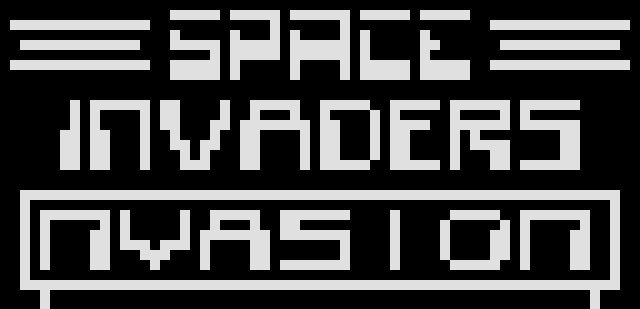

# chip8_emu


A CHIP-8 emulator written in C++17. SDL2 handles the window and keyboard, and the emulator core is kept separate from it so it can be tested without opening a window.



## Download

Grab the latest build from the [Releases page](https://github.com/anochronos/chip8_emu/releases/latest).

- **Windows:** unzip it, then drag a ROM onto `chip8.exe`, or run `chip8.exe path\to\game.ch8` from a terminal. The DLLs it needs are in the zip.
- **Linux:** extract the archive and run `./chip8 game.ch8`. You need SDL2 installed, for example `sudo apt install libsdl2-2.0-0` on Debian or Ubuntu.

The emulator doesn't ship with any games. CHIP-8 ROMs are easy to find online, and the [CHIP-8 test suite](https://github.com/Timendus/chip8-test-suite) is a good place to start if you want to check that an emulator behaves correctly.

## Controls

The original CHIP-8 keypad is a 4x4 grid, and it maps onto the left side of a QWERTY keyboard by position:

| CHIP-8 | | | |
|---|---|---|---|
| 1 | 2 | 3 | C |
| 4 | 5 | 6 | D |
| 7 | 8 | 9 | E |
| A | 0 | B | F |

| Your keyboard | | | |
|---|---|---|---|
| 1 | 2 | 3 | 4 |
| Q | W | E | R |
| A | S | D | F |
| Z | X | C | V |

Press Esc to quit.

## Building from source

You need a C++17 compiler, CMake 3.16 or newer, and the SDL2 development files.

**Linux (Debian or Ubuntu)**

```bash
sudo apt install build-essential cmake libsdl2-dev
cmake -S . -B build
cmake --build build
./build/chip8 game.ch8
```

**Windows (MSYS2 UCRT64 terminal)**

```bash
pacman -S mingw-w64-ucrt-x86_64-gcc mingw-w64-ucrt-x86_64-cmake mingw-w64-ucrt-x86_64-ninja mingw-w64-ucrt-x86_64-SDL2
cmake -S . -B build -G Ninja
cmake --build build
./build/chip8.exe game.ch8
```

## Tests

The tests load tiny hand-written ROMs, run a few cycles, and check the registers.

```bash
ctest --test-dir build --output-on-failure
```

GitHub Actions runs the build and the tests on Linux and Windows for every push and pull request.

## How it works

`src/chip8.cpp` holds the CPU: it fetches a two-byte opcode, decodes it with a switch, and updates the registers, memory, and a 64x32 pixel buffer. `src/main.cpp` is the frontend. It runs ten CPU cycles per frame at about 60 frames per second, ticks the delay and sound timers once per frame, and draws the pixel buffer to an SDL texture.

Shift instructions work on the register in place, and the load and store instructions leave the index register unchanged, which matches what most modern ROMs expect.

## Status

Sound is not implemented yet, so the buzzer is silent.

## License

See [LICENSE](LICENSE).